[README.md](https://github.com/user-attachments/files/30311451/README.md)
<div align="center">
  
  <br />
  <a href="https://git.io/typing-svg">
    
  </a>
  <br />
  
  
  
</div>

## About me

```bash
pedro@homelab:~$ whoami
Infrastructure and automation enthusiast

pedro@homelab:~$ interests
C++ | C#/.NET | Arduino Leonardo | Linux | Networking | IaC | Open Source

pedro@homelab:~$ mission
Build practical tools, automate repetitive work and document what I learn.
```

I enjoy connecting **software development** with **real infrastructure problems**. My main interests are network automation, monitoring, homelabs, infrastructure as code and open-source utilities that solve something useful.

- Working on practical tools for networks and systems administration
- Exploring reliable automation with C++, C#, Python and Arduino
- Interested in Linux, containers, virtualization, observability and secure infrastructure
- Open to collaborating on useful infrastructure and automation projects

## Tech stack

<div align="center">


</div>

## Featured projects

<table>
  <tr>
    <td width="50%" valign="top">
      <h3><a href="https://github.com/pedvrezz/netforge-iac">NetForge IaC</a></h3>
      <p>Network source of truth that validates VLANs, subnets, gateways and DHCP pools, then generates infrastructure configuration and documentation.</p>
      <p>  </p>
    </td>
    <td width="50%" valign="top">
      <h3><a href="https://github.com/pedvrezz/lantern-cpp">Lantern C++</a></h3>
      <p>Multithreaded TCP service inventory for private IPv4 networks, with table, JSON and CSV exports.</p>
      <p>  </p>
    </td>
  </tr>
  <tr>
    <td width="50%" valign="top">
      <h3><a href="https://github.com/pedvrezz/infrapulse-dotnet">InfraPulse .NET</a></h3>
      <p>Availability monitor for websites, APIs and TCP ports, with JSON and Prometheus-compatible output.</p>
      <p>  </p>
    </td>
    <td width="50%" valign="top">
      <h3><a href="https://github.com/pedvrezz/leonardo-deskpad">Leonardo DeskPad</a></h3>
      <p>A safe four-button USB macro pad for Arduino Leonardo with debounce, short/long presses and a physical enable switch.</p>
      <p>  </p>
    </td>
  </tr>
</table>

## GitHub activity

<div align="center">
  
  
</div>

<div align="center">
  
</div>

## Contribution snake

<picture>
  <source media="(prefers-color-scheme: dark)" srcset="./assets/github-contribution-grid-snake-dark.svg" />
  <source media="(prefers-color-scheme: light)" srcset="./assets/github-contribution-grid-snake.svg" />
  
</picture>

## What I value

```text
Useful software       > impressive demos with no purpose
Clear documentation   > hidden knowledge
Repeatable automation > manual configuration
Security by default   > convenience without limits
Continuous learning   > pretending to know everything
```

<div align="center"><sub>Build it. Test it. Document it. Improve it.</sub></div>
